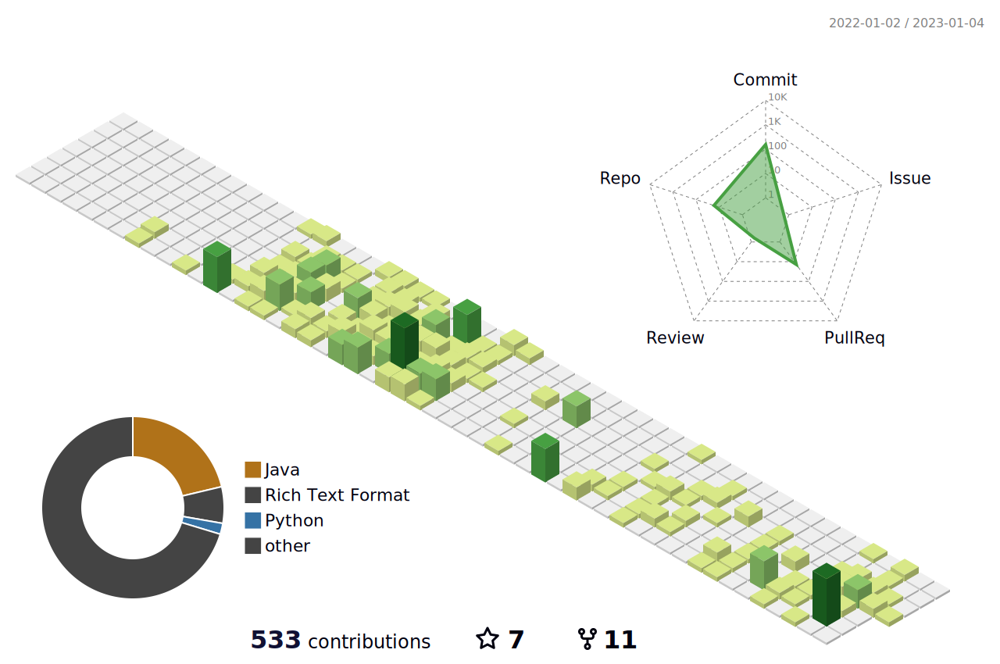

### Hi! Welcome to My GitHub Profile 👋

- 🔭 I’m Pre - Full Stack Automation Engineer                                                                              
- 🌱 I'm working on a project with framework TestNG and Cucumber
- 💪 Lifetime Path : Learn , practice and realise ! 
- ⚡ Fun fact: I love coding 💻, painting 🎨🖌, yoga 🧘🏻‍ and books 📚 
- ⏲ What we are doing now: i am writing code 🚀.
 
`</a>&nbsp;&nbsp;&nbsp;	

https://www.google.com/url?sa=i&url=https%3A%2F%2Fgiphy.com%2Fgifs%2Fart-painting-the-painter-dvNwhVCMyvEwSLPRem&psig=AOvVaw0NPu61DsyWNlAfdKC9QTc2&ust=1672960561770000&source=images&cd=vfe&ved=0CBAQjRxqFwoTCPi29_GFr_wCFQAAAAAdAAAAABAE
                                                                                                                                     

